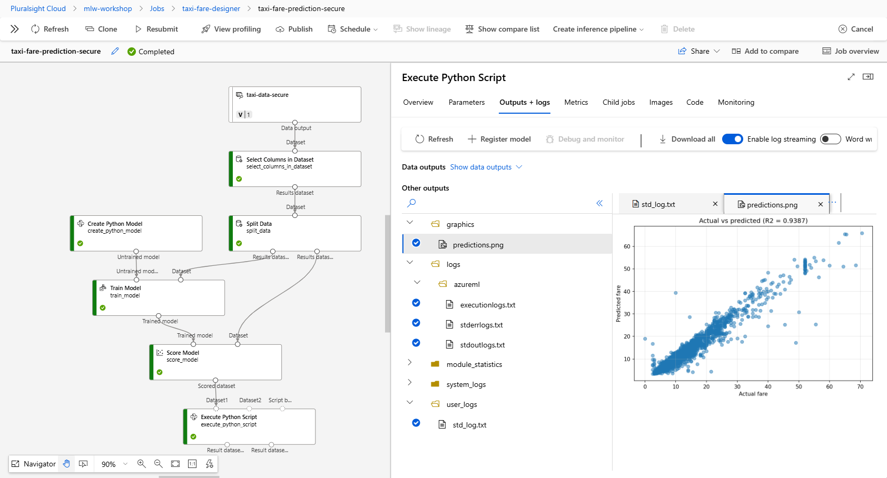
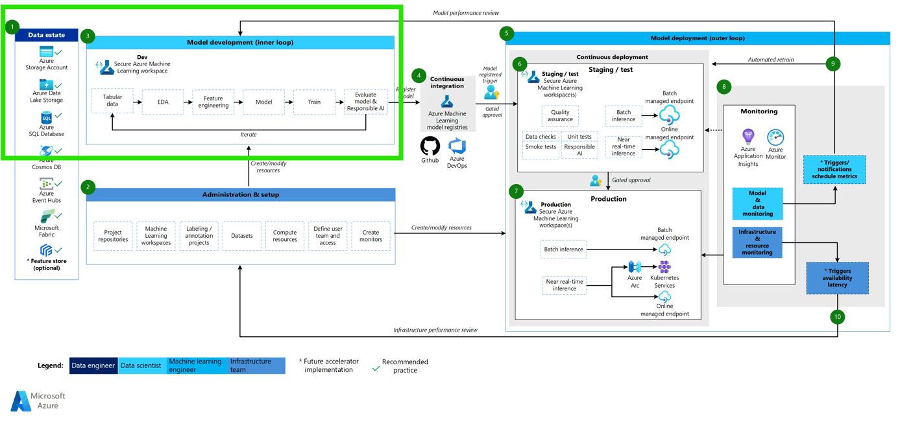
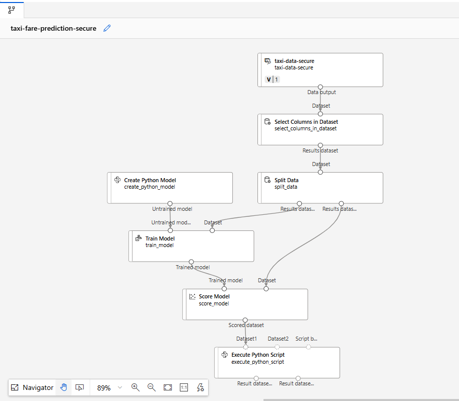
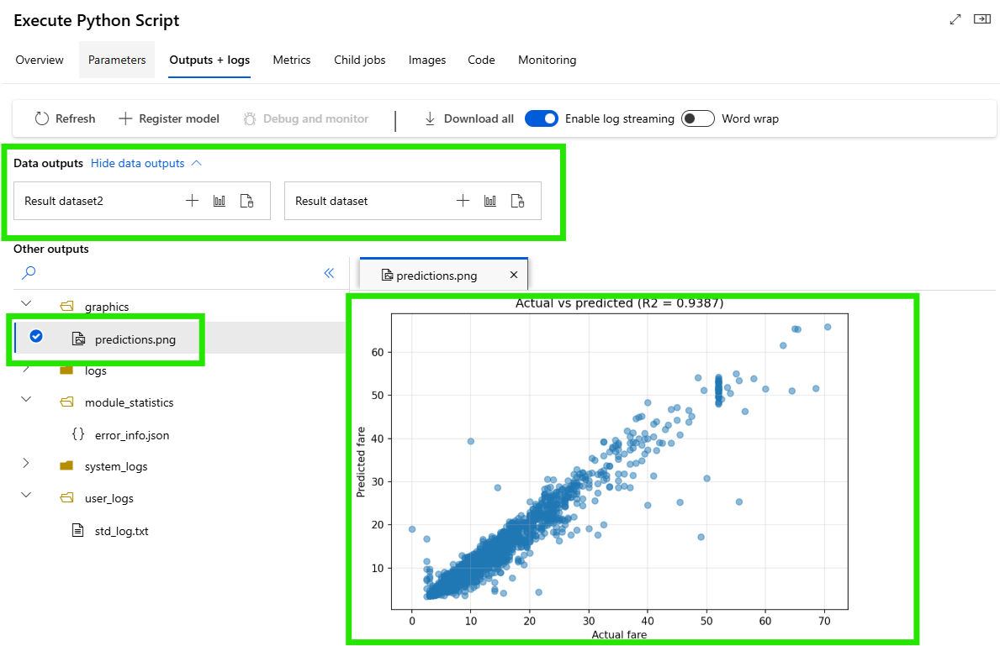
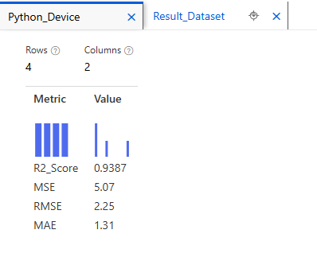
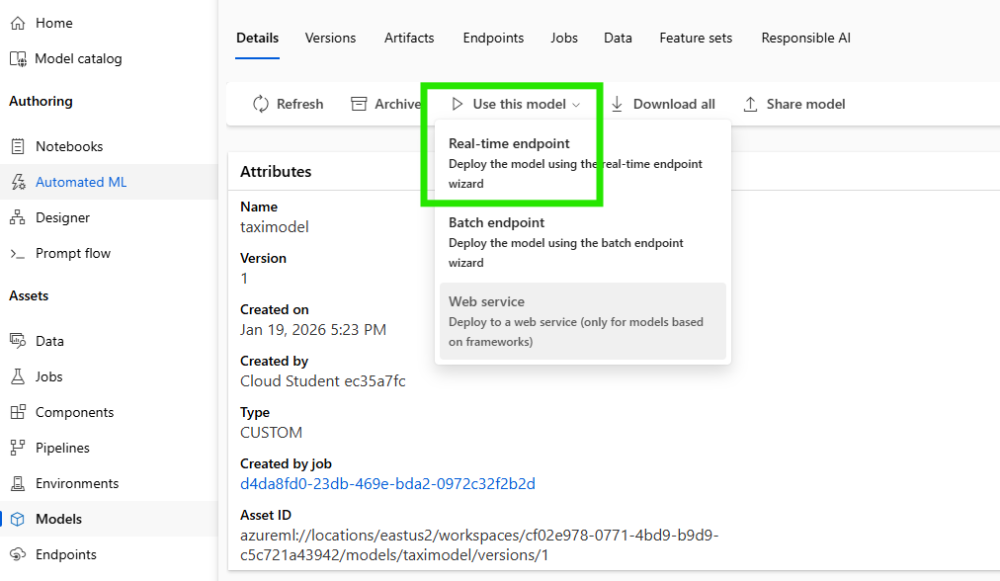

# Activity 11: Build a Secure ML Pipeline with Your Landing Zone

**🎯 Learning Objectives:**
- Connect an Azure ML workspace to the secure infrastructure from Activities 1–10
- Use secure storage for ML data (not external URLs)
- Build an ML pipeline that reflects governance and security principles
- Apply security and Infrastructure as Code thinking to ML workloads

**📋 What You'll Build:**

A complete ML pipeline that:
1. **Uses** the secure storage landing zone from Activities 1–10
2. **Loads** taxi trip data from secure blob storage
3. **Prepares** the data (select columns, split train and test)
4. **Trains** a Random Forest Regression model
5. **Evaluates** performance with metrics and visualisations
6. **Registers** the trained model for deployment



**🔗 Connection to Previous Activities:**
This activity brings together what you learned about secure infrastructure. Your ML workspace will use the secure storage account you deployed and validated in Activities 1–10.

You are going to build sections 1 and 2 shown in the Azure Classical machine learning architecture shown below:



Image from [here](https://learn.microsoft.com/en-us/azure/architecture/ai-ml/guide/machine-learning-operations-v2#classical-machine-learning-architecture).


---

## Note on MLflow

The original CLI based pipeline this exercise is [based upon](https://github.com/Azure/mlops-v2-ado-demo) uses **MLflow** for experiment tracking. However, MLflow is **not preinstalled** in Designer's Execute Python Script component.

For full MLflow support, use Azure ML SDK pipelines or notebooks instead of Designer. 

Notebooks is a final going further exercise at the end. Notebooks do work in the Pluralsight sandbox using the single compute we create below. You can install MLflow, or use a lightweight preinstalled option that is available.

However, SDK pipelines typically require creating a new environment, which Pluralsight will shutdown as it detects heavy compute. [This repo](https://github.com/Azure/mlops-v2-ado-demo) is an example of this pattern.

---

# Part 1: Set up

**🎯 Purpose:** Confirm access and capture a few values used later

## Step 1.1: Login and set common variables

- This time we need to create a new AI Sandbox to use Azure ML https://app.pluralsight.com/hands-on/playground/ai-sandboxes

⌨️ **Run:**

If in a Codespace, once you have created the new AI sandbox, first logout from the previous sandbox.

```bash
az logout
```

Then log in to the new AI sandbox

```bash
az login
```

Let's now capture and create some useful variables 

```bash
export rg=$(az group list --query "[0].name" -o tsv)
echo "Resource Group: $rg"

export LOCATION=$(az group show --name "$rg" --query location -o tsv)
echo "Location: $LOCATION"

export SUBSCRIPTION_ID=$(az account show --query id -o tsv)
echo "Subscription ID: $SUBSCRIPTION_ID"

export AML_WORKSPACE=mlw-workshop
echo "AML Workspace: $AML_WORKSPACE"
```

✅ **Checkpoint:** You see your resource group name, location, subscription ID, and workspace name printed

```bash
# Ensure the ML extension is available for later steps
az extension add -n ml -y 2>/dev/null || true
```

---

## Step 1.2: Create the secure storage account

This activity creates the secure storage account again from the earlier activities and uses the final solution example

⌨️ **Run:**

```bash
cd /workspaces/ai6_workshop-4

az deployment group create \
  --resource-group "$rg" \
  --template-file templates/main_secure_complete.bicep \
  --parameters env=dev location="$LOCATION" \
  --name secure-deployment
```

✅ **Checkpoint:** Deployment no longer says `Running..` and succeeds

Now let's store the new storage account name

```bash
export STORAGE_ACCOUNT=$(az deployment group show \
  --resource-group "$rg" \
  --name secure-deployment \
  --query "properties.outputs.storageAccountName.value" -o tsv)

echo "Storage Account: $STORAGE_ACCOUNT"
```

---

# Part 2: Create Azure ML Workspace

**🎯 Purpose:** Create an ML workspace that uses your secure storage just created above

## Step 2.1: Create workspace in the Portal

For speed, we will simply create this in the portal.

1. Open Azure Portal
2. Search for **Machine Learning**
3. Click **Create** → **New workspace**

**Basics tab:**
- **Resource group:** select your existing resource group (`$rg`)
- **Workspace name:** call it `mlw-workshop`
- **Region:** Leave as default selected
- **Storage account:** (CHANGE) select the storage account printed in `$STORAGE_ACCOUNT` with a name beginning with `safedev...`
- **Key vault:** Leave as default (new)
- **Application insights:** Leave as default (new)
- **Container registry:** Leave as None

Click **Review + Create** → **Create**

✅ **Checkpoint:** Workspace deployment succeeds with `Your deployment is complete`

---

## Step 2.2: Verify workspace (CLI)

⌨️ **Run:**

```bash
az ml workspace show \
  --name "$AML_WORKSPACE" \
  --resource-group "$rg" \
  --query "{name:name, storageAccount:storageAccount}" -o table
```

✅ **Checkpoint:** You see your workspace name

---

## Production note (read only)

In a real environment, teams normally create Azure ML workspaces using Infrastructure as Code so they are repeatable and reviewable. Options include Bicep and ARM, Terraform, or Azure CLI with a YAML definition.

📖 Learn more: Machine learning operations  
https://learn.microsoft.com/en-us/azure/architecture/ai-ml/guide/machine-learning-operations-v2

---

# Part 3: Prepare Data in Secure Storage

**🎯 Purpose:** Upload the taxi dataset into the workspace default datastore

When an ML workspace is created, it creates a default datastore called **workspaceblobstore** in your secure storage account. ML Studio's Data Asset browser uses this datastore, so we will upload the dataset there.

## Step 3.1: Download the taxi dataset

⌨️ **Run:**

```bash
curl -o taxi-data.csv https://raw.githubusercontent.com/Azure/mlops-v2-ado-demo/refs/heads/main/data/taxi-data.csv
ls -lh taxi-data.csv
```

✅ **Checkpoint:** You see `taxi-data.csv` (around 800 KB)

---

## Step 3.2: Find the default datastore container

⌨️ **Run:**

```bash
export DEFAULT_CONTAINER=$(az ml datastore show \
  --name workspaceblobstore \
  --resource-group "$rg" \
  --workspace-name "$AML_WORKSPACE" \
  --query container_name -o tsv)

echo "Default container: $DEFAULT_CONTAINER"
```

✅ **Checkpoint:** You see a container name printed (often starts `azureml-blobstore-...`)

---

## Step 3.3: Upload the file

**Option A: Portal upload**

1. Azure Portal → Resource group → your storage account (`$STORAGE_ACCOUNT`)
2. **Containers** → open the container named `$DEFAULT_CONTAINER`
3. Click **Upload**
4. Select `taxi-data.csv`
5. Click **Upload**

✅ **Checkpoint:** The file appears in the container

**Option B: CLI upload**

⌨️ **Run:**

```bash
az storage blob upload \
  --account-name "$STORAGE_ACCOUNT" \
  --container-name "$DEFAULT_CONTAINER" \
  --name taxi-data.csv \
  --file taxi-data.csv \
  --auth-mode login
```

✅ **Checkpoint:** Upload completes successfully

💡 **Note:** `--auth-mode login` uses identity based access rather than storage keys or SAS tokens.

---

## Step 3.4: Verify upload (CLI)

⌨️ **Run:**

```bash
az storage blob list \
  --account-name "$STORAGE_ACCOUNT" \
  --container-name "$DEFAULT_CONTAINER" \
  --auth-mode login \
  --query "[?name=='taxi-data.csv'].{Name:name, Size:properties.contentLength}" -o table
```

✅ **Checkpoint:** You see `taxi-data.csv` listed with a size value

---

# Part 4: Create a Compute Instance

**🎯 Purpose:** Create compute to run the Designer pipeline

## Step 4.1: Navigate to Compute

0. Find your Azure Machine Learning workspace and click on `Launch studio` blue button.
1. In the left menu, click **Compute**. (towards the bottom under `Manage`)
2. Select the default **Compute instances** tab
3. Click **+ New**

## Step 4.2: Configure the Compute Instance

1. **Compute name:** `designer-compute` (or any unique name)
2. **Virtual machine type:** CPU
3. **Virtual machine size:** First click `Select from all options`, sort by `cost` ascending, then find and select `Standard_D2s_v3` (2 cores, 8 GB RAM)
4. Click **Review + Create** followed by **Create**

Wait for status to show **Running**.

✅ **Checkpoint:** Compute status shows **Running**

💡 **Cost note:**
- In Pluralsight sandboxes, cost is not the concern, time limits are.
- In a real environment, stop compute instances when not in use.

---

# Part 5: Create a New Designer Pipeline

You don't need to wait for the compute to create to move to this part.

## Step 5.1: Open Designer

1. In the left menu, click **Designer**
2. Click **+ New pipeline** (in the **Classic prebuilt** tab).
3. Rename the pipeline to `taxi-fare-prediction-secure`
4. Enable **AutoSave** toggle at top.

---

# Part 6: Build the Pipeline

## Step 6.1: Add the data

1. In the left hand **Data** tab there is a `+` button.
2. **Name:** `taxi-data-secure`
3. **Type:** Select **Tabular**
4. Click **Next**

## Step 6.2: Choose Data Source

1. Select **From Azure storage**
2. Click **Next**
3. **Datastore:** Select **workspaceblobstore** (this is the default datastore)
4. Click **Browse**
5. You should see `taxi-data.csv` in the root of the container
6. Select `taxi-data.csv`
7. Click **Next**
8. Review the preview - you should see columns like `cost`, `distance`, `passengers`, etc.
9. You don't need to change any settings, just keep clicking **Next**.
10. Click **Create**

✅ **Checkpoint:** Data asset `taxi-data-secure` is created

## Step 6.3: Select Data

1. You can now drag your data asset onto the canvas!

## Step 6.4: Select columns

1. Now in the `Component` tab, Search for **Select Columns in Dataset**
2. Drag it onto the canvas
3. Connect: Data Asset → **Select Columns in Dataset**
4. Click the component, then click **Edit column**
5. Select **By name** and add all 21 columns:

```
cost, distance, dropoff_latitude, dropoff_longitude, passengers,
pickup_latitude, pickup_longitude, pickup_weekday, pickup_month,
pickup_monthday, pickup_hour, pickup_minute, pickup_second,
dropoff_weekday, dropoff_month, dropoff_monthday, dropoff_hour,
dropoff_minute, dropoff_second, store_forward, vendor
```

6. Click **Save**

## Step 6.5: Split the data

1. Search for **Split Data** and drag it below Select Columns
2. Connect Select Columns → Split Data
3. Configure Split Data:
   - **Splitting mode:** Split Rows
   - **Fraction of rows in the first output:** `0.7`
   - **Randomised split:** Yes
   - **Random seed:** `42`
4. Click **Save**

Outputs will be:
- Left output: training (70%)
- Right output: test (30%)

## Step 6.6: Create the custom Python model

1. Search for **Create Python Model**
2. Drag it onto the canvas
3. Paste this code entirely over the existing **Python script**:
4. Click **Save**

```python
import pandas as pd
import numpy as np
from sklearn.ensemble import RandomForestRegressor
from sklearn.metrics import r2_score, mean_squared_error, mean_absolute_error

class AzureMLModel:
    def __init__(self):
        self.n_estimators = 500
        self.max_depth = 10
        self.bootstrap = True
        self.max_features = "auto"
        self.min_samples_leaf = 4
        self.min_samples_split = 5

        self.model = RandomForestRegressor(
            n_estimators=self.n_estimators,
            max_depth=self.max_depth,
            bootstrap=self.bootstrap,
            max_features=self.max_features,
            min_samples_leaf=self.min_samples_leaf,
            min_samples_split=self.min_samples_split,
            random_state=42,
        )
        self.feature_column_names = list()

    def train(self, df_train, df_label):
        self.feature_column_names = df_train.columns.tolist()

        self.model.fit(df_train, df_label)

        yhat = self.model.predict(df_train)
        r2 = r2_score(df_label, yhat)
        mse = mean_squared_error(df_label, yhat)
        rmse = np.sqrt(mse)
        mae = mean_absolute_error(df_label, yhat)

        print(f"Training R2: {r2:.4f}")
        print(f"Training RMSE: {rmse:.2f}")
        print(f"Training MAE: {mae:.2f}")

    def predict(self, df):
        predictions = self.model.predict(df[self.feature_column_names])
        return pd.DataFrame({"Scored Labels": predictions})
```

## Step 6.7: Train the model

1. Add **Train Model**
2. Connect:
   - Create Python Model → Train Model (left input)
   - Split Data (left training output) → Train Model (right input)
3. Configure Train Model:
   - **Label column:** `cost`
4. Click **Save**

## Step 6.8: Score the model

1. Add **Score Model**
2. Connect:
   - Train Model → Score Model (left input)
   - Split Data (right test output) → Score Model (right input)

## Step 6.9: Evaluate the model (custom Python script)

The built in **Evaluate Model** component does not support custom Python models, so we will calculate metrics ourselves.

1. Add **Execute Python Script**
2. Connect Score Model output → Execute Python Script **Dataset1**
3. Replace the code with:
4. Click **Save**

```python
import pandas as pd
import numpy as np
from sklearn.metrics import r2_score, mean_absolute_error, mean_squared_error
from matplotlib import pyplot as plt
from azureml.core import Run

def azureml_main(dataframe1=None, dataframe2=None):
    y_true = dataframe1["cost"]
    y_pred = dataframe1["Scored Labels"]

    r2 = r2_score(y_true, y_pred)
    mse = mean_squared_error(y_true, y_pred)
    rmse = np.sqrt(mse)
    mae = mean_absolute_error(y_true, y_pred)

    print("=" * 60)
    print("MODEL EVALUATION METRICS (Test Set)")
    print("=" * 60)
    print(f"R2 Score:                 {r2:.4f}")
    print(f"Mean Squared Error:       {mse:.2f}")
    print(f"Root Mean Squared Error:  {rmse:.2f}")
    print(f"Mean Absolute Error:      {mae:.2f}")
    print("=" * 60)

    # Visualisation: Actual vs predicted
    plt.figure(figsize=(7, 5))
    plt.scatter(y_true, y_pred, alpha=0.5)
    plt.xlabel("Actual fare")
    plt.ylabel("Predicted fare")
    plt.title(f"Actual vs predicted (R2 = {r2:.4f})")
    plt.grid(True, alpha=0.3)

    img_file = "predictions.png"
    plt.tight_layout()
    plt.savefig(img_file, dpi=150, bbox_inches="tight")

    run = Run.get_context(allow_offline=True)
    run.upload_file(f"graphics/{img_file}", img_file)
    print(f"Plot saved to outputs: graphics/{img_file}")

    metrics_df = pd.DataFrame(
        {
            "Metric": ["R2_Score", "MSE", "RMSE", "MAE"],
            "Value": [round(r2, 4), round(mse, 2), round(rmse, 2), round(mae, 2)],
        }
    )

    residuals = y_true - y_pred
    dataframe1["predicted_fare"] = y_pred
    dataframe1["prediction_error"] = residuals
    dataframe1["absolute_error"] = abs(residuals)

    return dataframe1, metrics_df
```

---

# Part 7: Your Complete Pipeline

Your pipeline should look like this:



---

# Part 8: Run the Pipeline

## Step 8.1: Submit the pipeline

1. Click **Configure & Submit**
2. For **Experiment name**, select **Create new** then name it `taxi-fare-designer`
3. In left panel click **Runtime settings** and from **Select compute type** select `Compute instance`
4. From **Select Azure ML compute instance** select the compute created earlier called `designer-compute`.
5. Click **Review & Submit** then **Submit**

## Step 8.2: Monitor progress

1. Open the run from the notification, or go to **Jobs**
2. Watch components move from queued to running to completed

## Step 8.3: View results

**Output & Metrics:**


As below, click **Show data outputs** then click on the **Preview data** buttons for both data outputs.





---

# Part 9: Understanding the Results

| Metric | Meaning | A useful target |
|--------|---------|-----------------|
| **R2** | Variance explained (0–1) | > 0.8 |
| **RMSE** | Typical error size | Lower is better |
| **MAE** | Typical absolute error | Lower is better |

---

# Part 10: Register and Deploy the Model

## Step 10.1: Register the trained model

1. Click the **Train Model** component in your pipeline run.
2. Open **Outputs + logs**.
3. Select **`trained_model_outputs/`** (the folder).
4. Click **Register model** and name it (for example: `rf-taxi-fare-secure`).

✅ **Checkpoint:** The model appears under **Models** in Azure ML Studio.

## Step 10.2: Get the scoring script (needed for deployment)

The deployment wizard needs a scoring script to handle incoming requests and return predictions.

Open:

**Train Model → Outputs + logs → trained_model_outputs/** → download **`score.py`**

## Step 10.3: Deploy (optional)

From the **Models** tab, select your model and choose **Deploy**.



⚠️ **Pluralsight sandbox note:** Real time endpoints trigger extra compute and Pluralsight may shut down the sandbox. For this workshop, registration is enough to demonstrate the workflow.

If you do deploy, you will find the endpoint under **Endpoints** in the left menu.

---

# Part 11: Security Review and Learn More

**🎯 Purpose:** Verify storage security settings and explore Azure ML security docs

## Step 11.1: Verify storage security

⌨️ **Run:**

```bash
az storage account show \
  --name "$STORAGE_ACCOUNT" \
  --resource-group "$rg" \
  --query "{name:name, allowBlobPublicAccess:allowBlobPublicAccess, minimumTlsVersion:minimumTlsVersion}" \
  -o table
```

✅ **Checkpoint:**
- `allowBlobPublicAccess` = `False`
- `minimumTlsVersion` = `TLS1_2`

---

## Step 11.2: Learn more

| Topic | Link | What you'll cover |
|-------|------|-------------------|
| Enterprise security overview | https://learn.microsoft.com/en-us/azure/machine-learning/concept-enterprise-security | Identity, network controls, encryption |
| Secure workspace tutorial | https://learn.microsoft.com/en-us/azure/machine-learning/tutorial-create-secure-workspace | Private endpoints, managed VNets |
| Identity based service authentication | https://learn.microsoft.com/en-us/azure/machine-learning/how-to-identity-based-service-authentication | Why identity based access is preferable |
| Responsible AI | https://learn.microsoft.com/en-us/azure/machine-learning/concept-responsible-ai | Fairness, transparency, accountability |

---

## Step 11.3: Update handoff documentation

If you completed Activity 9, add these notes to your handoff document.

📝 **Add to `HANDOFF.md`:**

```markdown
## Machine Learning Infrastructure (Dev and test)

- Workspace: mlw-workshop (created via Portal for workshop purposes)
- Storage: Uses secure storage from Activities 1–10
- Data access: Identity based access (no SAS tokens or storage keys)
- Compute: Stop instances when not in use

### Production note
For production, use Infrastructure as Code (Bicep, Terraform, or CLI YAML) and follow the Azure ML secure workspace guidance:
- Enterprise security: https://learn.microsoft.com/en-us/azure/machine-learning/concept-enterprise-security
- Secure workspace tutorial: https://learn.microsoft.com/en-us/azure/machine-learning/tutorial-create-secure-workspace
- CLI workspace management: https://learn.microsoft.com/en-us/azure/machine-learning/how-to-manage-workspace-cli
```

---

# Going Further: Apply to Your EPA Project

## Option 1: Build a pipeline with your own data

1. Find or create a dataset:
   - Public datasets from Kaggle, UCI, or Azure Open Datasets
   - Synthetic data that matches your project shape
   - Do not use real company data in a sandbox
2. Upload it to the workspace default datastore container
3. Build a Designer pipeline that fits your use case
4. Document your approach in your handoff notes

## Option 2: Use notebooks for MLflow tracking

Notebooks give full MLflow support for tracking runs and comparing models.

1. In Azure ML Studio, open **Notebooks**
2. Create `epa-experiment.ipynb`
3. Use your existing compute instance

Tip: In **Data**, open your data asset and use the **Consume** tab to copy the auto generated loading code.

---